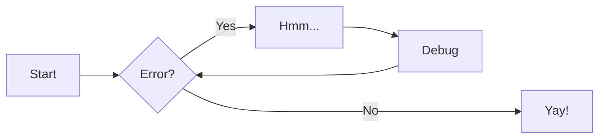
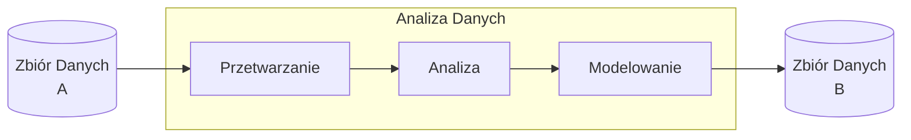
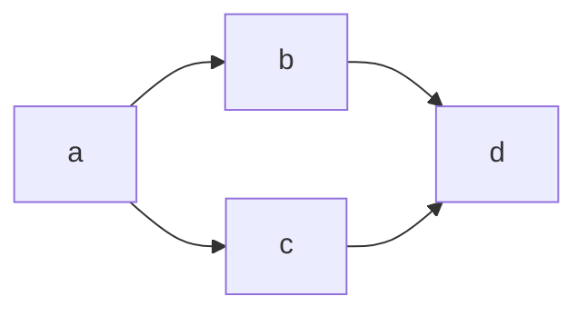

# 2024-01 notebook

## Add notebook below

``` mermaid
graph LR
  A[Start] --> B{Error?};
  B -->|Yes| C[Hmm...];
  C --> D[Debug];
  D --> B;
  B ---->|No| E[Yay!];
```

```mermaid


flowchart LR
    A[(Zbiór Danych\nA)] --> B[Przetwarzanie]
    subgraph Analiza Danych
        B --> C[Analiza] --> D[Modelowanie]
    end
    D --> E[(Zbiór Danych\nB)] 
```

```mermaid
---
My 2024 January leanring path
---
flowchart LR
   a --> b & c--> d
```

flowchart LR
    1 o--o 2
    2 <--> 3
    3 x--x 4
